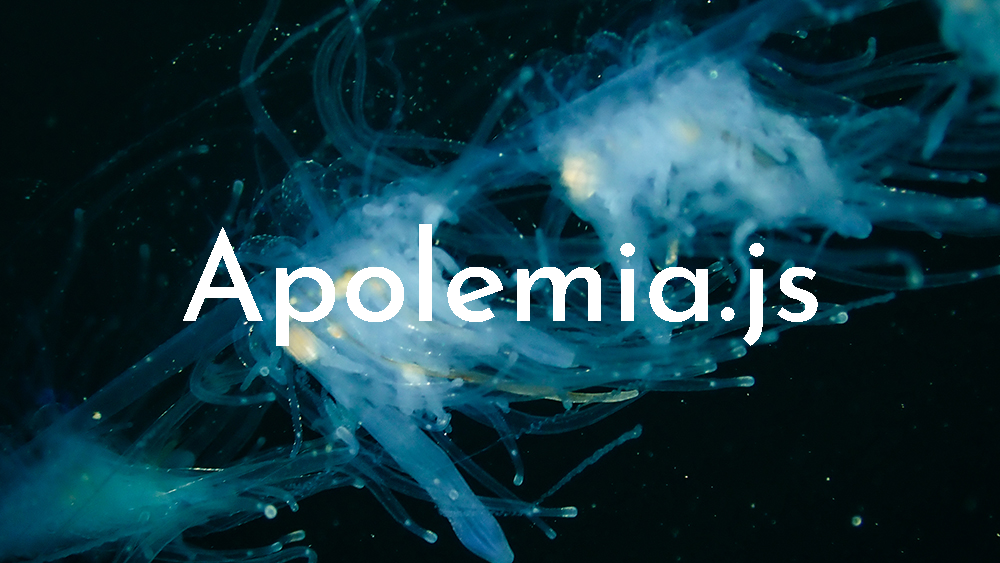

<div align="center">
  <br>
</div>

###### Photo by Jose M. Juárez

---------------------

<br>

### **Apolemia.js** is a Distributed Computing OpenSource Framework designed to facilitate the creation of distributed computing platforms based on a cluster.

<br>
<br>

## Installation
  First Install the following dependencies:

  - [Nodejs](https://nodejs.org/en) v.18.16.0 LTS or above
  - npm [requirements](./requirements.txt)
    - express
    - adm-zip
    - crypto
    - ws

  Then open the [configuration](./config.json) file and change the master_ip parameter, it must have as a value the master's ip or hostname.

  Finally, add to PATH the [bin](./bin/) folder.

## Usage

### Master Creation
Inside Apolemia.js's root folder execute:
```bash
node master.js
```

### Slave Creation
Inside Apolemia.js's root folder execute:
```bash
node slave.js
```

### **Generate Request**
It's easy, just put `apolemia.sh` or `apolemia.bat`, depending on your OS, before the command that executes your project, just as you would normally execute it.
```bash
# Windows
apolemia.bat <command + args>

# Linux
apolemia.sh <command + args>

# For example:
apolemia.sh python3 main.py 27 ./data/city.csv
apolemia.sh node tester.js
```

## Monitorization
Master comes with a web server on the port defined on the [configuration](./config.json) file where you can view the current Cluster's stats general stats, detailed information of every slave connected to the cluster and real-time data of all the requests active on master.

## Apolemia.js Internal WorkFlow
----
<div align="center">
  <br>
</div>

----
